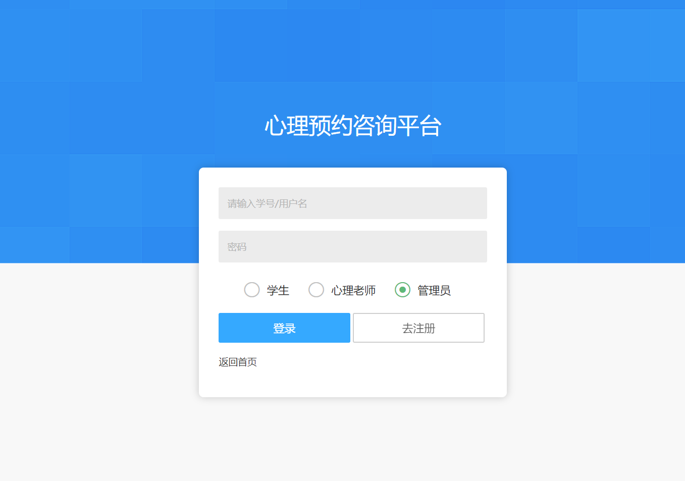
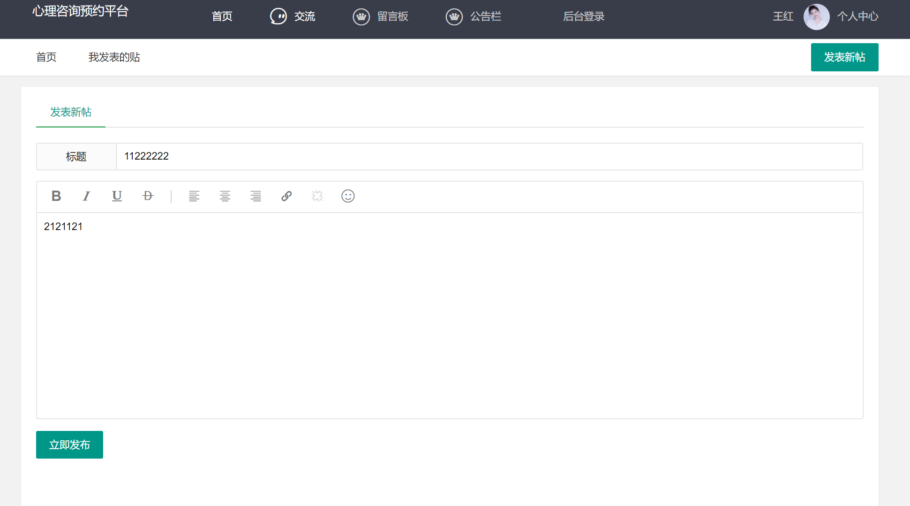
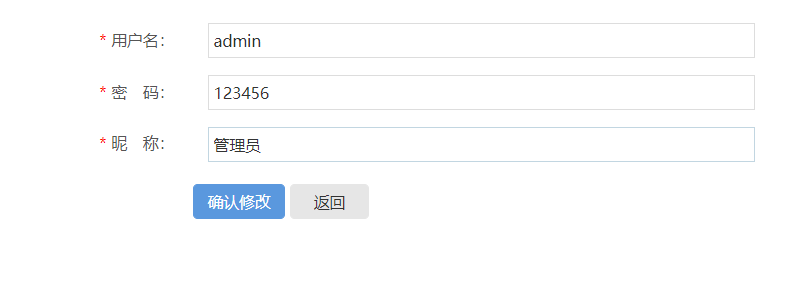
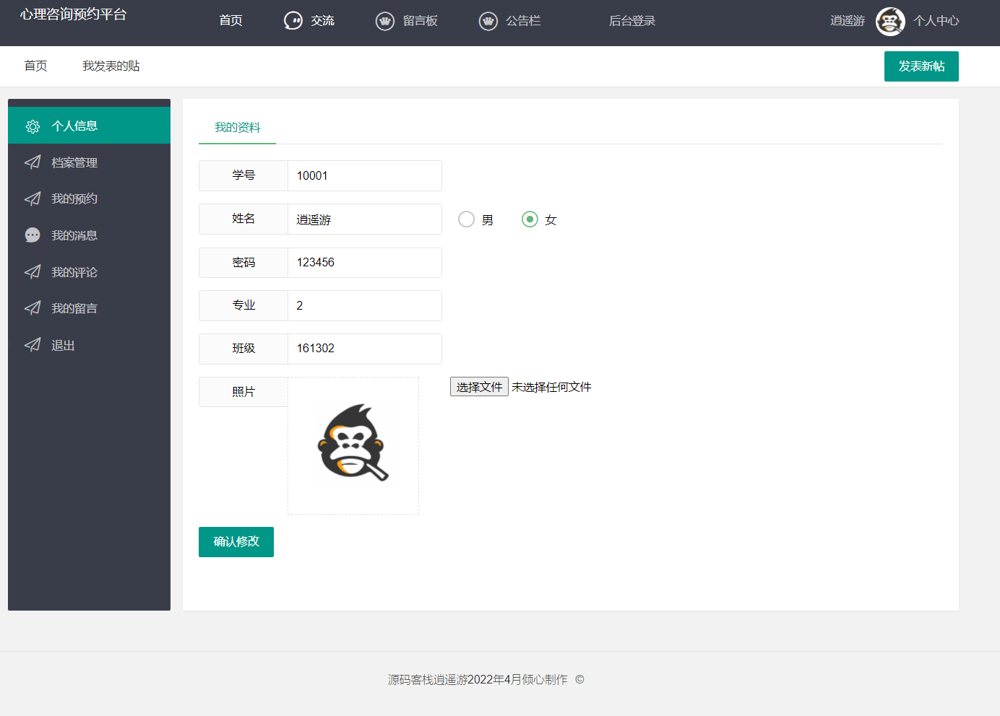
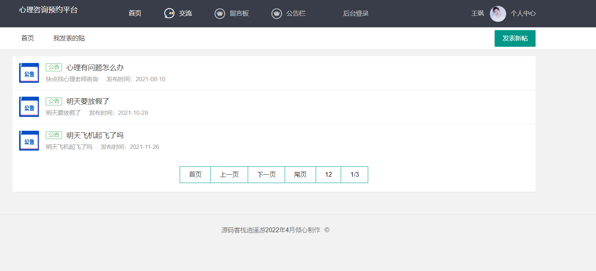
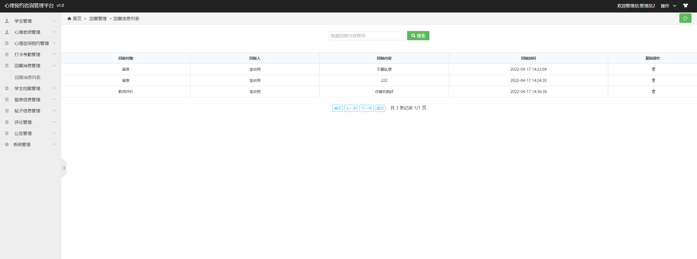
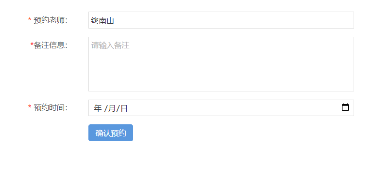
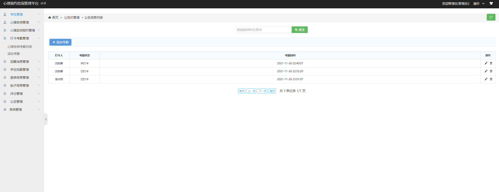
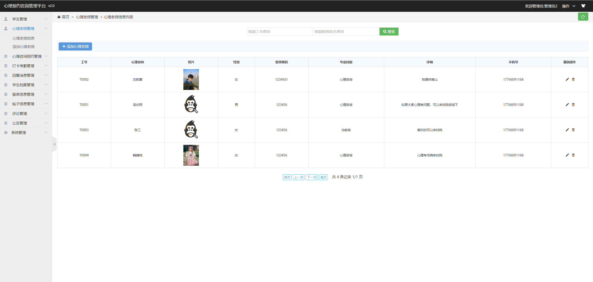

## 基于JSP+Servlet实现的心理预约咨询管理系统

###  获取sql数据库文件: 从戎源码网 (https://armycodes.com/) QQ: 386869957 QQ群: 377586148
###  所有系统地址: (https://github.com/YuLin-Coder/AllProjectCatalog) 
###  所有项目以及源代码本人均调试运行无问题 可支持远程安装部署调试、定制修改、代码讲解

## 项目介绍
基于JSP+Servlet实现的心理预约咨询管理系统，主要功能如下

本系统分为网站和后台，主要是学生可以平台进行预约心理老师进行咨询心理健康问题，也可以评论老师、发布帖子、在线留言等，心理老师负责审核学生的预约信息，可以回复学生的信息咨询信息，管理员负责管理后台信息等。
主要功能
学生注册、登录后可以进行个人信息维护以及查看心理老师进行预约，以及查看公告、发布帖子、查看帖子、查看心理老师、评论老师、评论帖子、发布留言、查看我的消息、上传下载学生档案信息、管理评论信息等功能模块。
心理老师登录后可以查看、修改个人信息，审核同意学生预约请求，查看公告、打卡考勤、查看、回复学生的评论、回复学生留言、查看下载学生档案、回复消息管理等等操作。
管理员登录后能够对学生信息、心理老师、心理预约咨询管理、打卡考勤管理、回复消息管理、学生档案管理、留言信息管理、帖子信息管理、评论、公告管理、系统管理等操作

## 项目技术
- 编程语言：Java
- 数据库：MySQL
- 前端技术：JSP、JavaScript、bootstrap、JQuery
- 后端技术：Servlet、JDBC

## 运行环境
- JDK版本：JDK1.8及以上
- 开发工具：IDEA、Ecplise、Myecplise都可以
- 数据库: MySQL5.7及以上

## 运行截图

